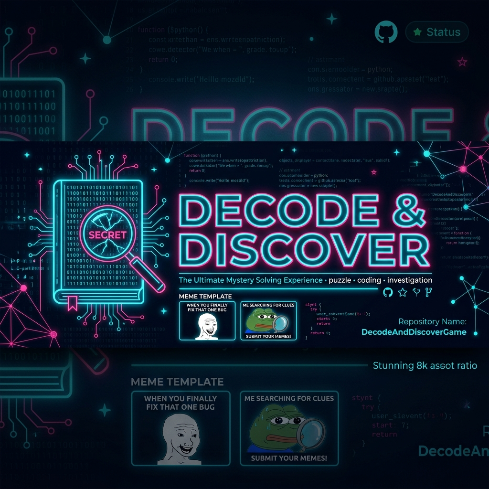
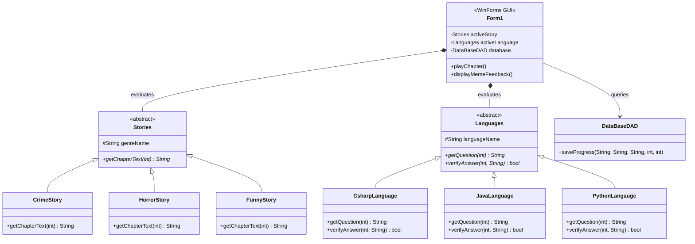

# 🔍 Decode-And-Discover

[](https://learn.microsoft.com/en-us/dotnet/csharp/)
[](#)
[](#🗃️-database-setup-mysql)
[](https://opensource.org/licenses/MIT)

An interactive **Windows Forms** application that blends branching storytelling and programming quizzes, delivering custom score-based meme feedback! Choose your favorite narrative genre (Crime, Horror, Funny) and programming language (C#, Java, Python), then solve language-specific code puzzles while unraveling a gripping story.

---

<p align="center">
  
</p>

---

## 🗺️ Navigation Index

1. [📚 Key Features](#-features)
2. [🏗️ Application OOP Architecture](#%EF%B8%8F-application-oop-architecture)
3. [💡 Technologies Used](#-technologies-used)
4. [🎮 How to Play](#-how-to-play)
5. [🗃️ Database Setup (MySQL)](#%EF%B8%8F-database-setup-mysql)
6. [🤝 Contributing](#-contributing)

---

## 📚 Features

- 🎭 **Choose-Your-Own-Adventure:** Multiple storytelling tracks including **Crime**, **Horror**, and **Funny**.
- 🧠 **Code Quizzes:** Practice actual code puzzles in **C#**, **Java**, or **Python** within the narrative chapters.
- 📈 **Score-Based Progression:** Progression maps directly to your quiz performance.
- 🖼️ **Meme Feedback:** Dynamically fetches and displays feedback memes based on your current points tier.
- 🏗️ **Clean OOP Architecture:** Uses inheritance, polymorphism, encapsulation, and abstractions to manage stories and language models.
- 💾 **State Persistence:** Saves player stats, choices, and scores to a local MySQL DB.

---

## 🏗️ Application OOP Architecture

The game utilizes strict OOP modeling to decouple story tracks and programming languages:



---

## 💡 Technologies Used

- **C# & .NET Framework** (Windows Forms GUI)
- **Object-Oriented Programming Patterns**
- **XAMPP / MySQL** (Database State persistence)
- **Visual Studio 2022**

---

## 🎮 How to Play

1. **Clone the repository:**
   ```bash
   git clone https://github.com/asad594/Decode-And-Discover.git
   cd Decode-And-Discover
   ```
2. Open `DecodeAndDiscovers.sln` in **Visual Studio**.
3. Setup the database tables (see [Database Setup](#🗃️-database-setup-mysql)).
4. **Build & Run** the project (F5).
5. Enter your player profile name, pick a story genre + target coding language, and start solving code puzzles!

---

## 🗃️ Database Setup (MySQL)

1. Open **XAMPP Control Panel** and start the **Apache** and **MySQL** services.
2. Open your browser and navigate to: [http://localhost/phpmyadmin](http://localhost/phpmyadmin)
3. Create a new database called `decode_db`.
4. Import the SQL file from the directory: `decodeanddiscovers.sql` (or run this query in phpMyAdmin's SQL tab):

```sql
CREATE TABLE player_progress (
    id INT AUTO_INCREMENT PRIMARY KEY,
    player_name VARCHAR(50),
    selected_story VARCHAR(50),
    selected_language VARCHAR(50),
    chapter_number INT,
    score INT
);
```

---

## 🤝 Contributing

Contributions, enhancements, and suggestions are always welcome!
Feel free to fork the repository, build new story branches or add new language quiz files on a feature branch, and submit a Pull Request.

---

## 📜 License
Distributed under the **MIT License**. See `LICENSE` for details.
